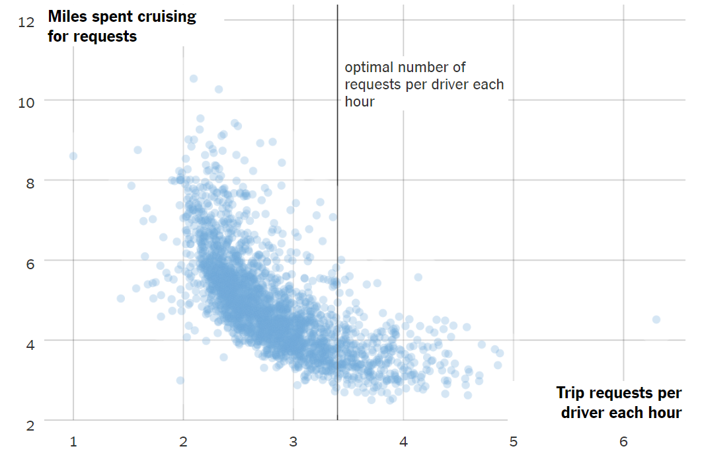

To download this RMarkdown file, go to: <https://app.box.com/s/4x41p7a3vltjmf2zm7r6p9kktrsyl3dg>

Click “Download” and save the RMarkdown (.Rmd) file in the **same** folder as
your RStudio project

```{r setup, include=FALSE}
library(knitr)
library(rmdformats)

## Global options
options(max.print="75")
opts_chunk$set(cache=TRUE,
               prompt=FALSE,
               tidy=TRUE,
               comment=NA,
               message=FALSE,
               warning=FALSE, 
               results = 'hold')
opts_knit$set(width=75)
```

<center>

### Workshop Overview 

__Teaching__: 60 minutes  
__Exercises__: 20 minutes

__Guiding Questions__:

What are the components of a ggplot?  
How do I create scatterplots, boxplots, and barplots?  
How can I change the aesthetics (ex. colour, transparency) of my plot?  
How can I create multiple plots at once?  

__Lesson Objectives__:

Produce scatter plots, boxplots, and barplots using ggplot.  
Set universal plot settings.  
Describe what faceting is and apply faceting in ggplot.  
Modify the aesthetics of an existing ggplot plot (including axis labels and
colour).  
Build complex and customized plots from data in a data frame.  
 
</center>

We start by loading the required package. **`ggplot2`** is also included in the
**`tidyverse`** package.

```{r}
library(tidyverse)
```

If not still in the workspace, load the data we saved in the previous lesson.


```{r}
gapminder <- read_csv(
  here::here("data", "gapminder_data.csv")
)
```


# Warm-up 



# Describe the qualities of this plot. 

</br> 
</br> 
</br> 

# Data Visualization using **`ggplot2`** 

**`ggplot2`** is a plotting package that makes it simple to create complex plots
from data in a data frame. It provides a more programmatic interface for
specifying what variables to plot, how they are displayed, and general visual
properties. Therefore, we only need minimal changes if the underlying data 
change or if we decide to change from a bar plot to a scatter plot. This helps 
in creating publication quality plots with minimal amounts of adjustments and 
tweaking.

Packages in `R` are basically sets of additional functions that let you do more
stuff. The functions we've been using so far, like `str()` or `mean()`,
come built into `R`; packages give you access to more of them. Before you use a
package for the first time you need to install it on your machine, and then you
should import it in every subsequent `R` session when you need it. You should
already have installed the **`tidyverse`** package. This is an
"umbrella-package" that installs several packages useful for data analysis which
work together well such as **`tidyr`**, **`dplyr`**, **`ggplot2`**, 
**`readr`**, **`forcats`**, etc.

The **`tidyverse`** package tries to address common issues that arise when
doing data analysis with some of the functions that come with `R`. 

1. The `tidyverse` solves complex problems by combining many simple pieces.

> No matter how complex and polished the individual operations are, 
> it is often the quality of the glue that most directly determines 
> the power of the system.
> - Hal Abelson

2. The `tidyverse` is written for people to read! 

> Computer efficiency is a secondary concern because the 
> bottleneck in most data analysis is thinking time, not computing time.
> - Hadley Wickham

If we haven't already done so, we can type `install.packages("tidyverse")` 
straight into the console. In fact, it's better to write this in the console 
than in our script for any package, as there's no need to re-install packages 
every time we run the script.

Then, to load the package type:

```{r}
## load the tidyverse packages
library(tidyverse)
```

To learn more about **`ggplot2`** after the workshop, you may want
to check out this
[**`ggplot2`** reference website (link)](https://ggplot2.tidyverse.org/reference/) 
and this [handy cheatsheet on **`ggplot2`** (link)](https://github.com/rstudio/cheatsheets/raw/master/data-visualization-2.1.pdf).


## gapminder data 

We'll read in the `gapminder` data from yesterday using the `read_csv()`
function and the `here()` function. 

```{r}
gapminder <- read_csv(
  here::here("data", "gapminder_data.csv")
)

```


## Plotting with **`ggplot2`**

`ggplot2` functions like data in the 'long' format, i.e., a column for every 
dimension, and a row for every observation. There are other data formats, which 
we will discuss in the _Data Wrangling in `R`_ workshop, as well as how to 
covert from one data format to another. Well-structured data will save you 
lots of time when making figures with `ggplot2` and when working in `R`!

`ggplot()` graphics are built step by step by adding new elements. Adding layers 
in this fashion allows for extensive flexibility and customization of plots.

To build a `ggplot()`, we will use the following basic template that can be used 
for different types of plots:

```
ggplot(data = <DATA>, mapping = aes(<VARIABLE MAPPINGS>)) +  
<GEOM_FUNCTION>()
```

</br>

Let's go through this step by step!  

1. Use the `ggplot()` function and bind the plot to a specific data frame using 
the `data` argument

```{r}
ggplot(data = gapminder) 
## Creates a blank ggplot(), referencing the gapminder dataset
```

2. Define a mapping (using the aesthetic (`aes`) function), by selecting the 
variables to be plotted and specifying how to present them in the graph, e.g. as
x/y positions or characteristics such as size, shape, color, etc.

```{r}
ggplot(data = gapminder, 
       mapping = aes(x = gdpPercap, y = lifeExp))
## Creates a blank ggplot(), with the variables mapped to the x- and y-axis
## ggplot() knows where the variables live, since you have defined the data to use
```

3. Add 'geoms' -- graphical representations of the data in the plot (points,
  lines, bars). **`ggplot2`** offers many different geoms; we will use some 
  common ones today, including:
  
      * `geom_point()` for scatter plots
      * `geom_boxplot()` for boxplots   
      * `geom_bar()` for bar charts 
      * `geom_line()` for trend lines, time series, etc.  

Because we have two continuous variables in the data, let's use `geom_point()`
first:

```{r}
ggplot(data = gapminder, 
       mapping = aes(x = gdpPercap, y = lifeExp)) +
  geom_point()
 ## Adds a point for each row (observation) in the data  
```

You can think of the `+` sign as adding layers to the plot. 
Each `+` sign must be placed at the end of the line containing the *previous* 
layer. If, instead, the `+` sign is added at the beginning of the line 
containing the new layer, **`ggplot2`** will not add the new layer and will 
return an error message.

```{r, error = TRUE}
# This is the correct syntax for adding layers
ggplot(data = gapminder, 
       mapping = aes(x = gdpPercap, y = lifeExp)) +
  geom_point()

# This will not add the new layer and will return an error message
ggplot(data = gapminder, 
       mapping = aes(x = gdpPercap, y = lifeExp)) 
+ geom_point()
```


## Building Plots Iteratively 

Building plots with **`ggplot2`** is typically an iterative process. We start by
defining the dataset we'll use, lay out the axes, and choose a geom:

```{r}
ggplot(data = gapminder, 
       mapping = aes(x = gdpPercap, y = lifeExp)) +
  geom_point()
```

Then, we start modifying this plot to extract more information from it. For
instance, we can add transparency (`alpha`) to the points, to avoid 
overplotting:

```{r}
ggplot(data = gapminder, 
       mapping = aes(x = gdpPercap, y = lifeExp)) +
  geom_point(alpha = 0.2)
    ## alpha reduces the opacity of the points 
    ## 0 is fully transparent
    ## 1 is the original opacity
```

We can also add colors for all the points:

```{r}
ggplot(data = gapminder, 
       mapping = aes(x = gdpPercap, y = lifeExp)) +
  geom_point(alpha = 0.1, color = "blue")
```

### Your turn! 

## Challenge 1

`geom_point` also accepts aesthetics of size and shape. 
The size of a point is its width in mm. The shape of a point has five 
different options for plotting:  

* an integer [0, 25] of defined plotting characters -- same as base `R`
* the name of the shape in quotations (e.g. "circle open" or "diamond filled")
* a single character, to use that character as a plotting symbol
* a "." to draw the smallest point that is visible -- typically 1 pixel
* an NA, to draw nothing

Reference for shapes in integers and characters:  
https://ggplot2.tidyverse.org/articles/ggplot2-specs.html  

> Modify the previous code chunk to assign one of these aesthetics to the 
> `geom_point` aspect of your plot. What happened? 

```{r}
## Your ggplot code to answer the challenge goes here!


```


## Assigning More Variables to Aesthetics 

To color each continent in the plot differently, you could use a vector as an
input to the argument **color**. **`ggplot2`** will provide a different color 
corresponding to different values in the vector. Here is an example where we 
color with **`continent`**:

```{r}
ggplot(data = gapminder, 
       mapping = aes(x = gdpPercap, y = lifeExp)) +
  geom_point(alpha = 0.1,  aes(color = continent)) 
```

**Note:** When specifying an `alpha` for a scatterplot, it automatically uses 
that __same__ `alpha` in the legend. To remedy this you can add:  

```
guides(colour = guide_legend(override.aes = list(alpha = 1)))
```
to your plot. This customizes the legend appearance, similar to what we will 
see in the customization section. 

</br>
</br>

We can also specify the colors directly inside the mapping provided in the 
`ggplot()` function. This will be seen by **any** geom layers and the mapping 
will be determined by the x- and y-axis set up in `aes()`.

```{r}
ggplot(data = gapminder, 
       mapping = aes(x = gdpPercap, y = lifeExp, color = continent)) +
  geom_point(alpha = 0.2)
```

Notice that we can change the geom layer and colors will be still determined by
**`continent`**


### Local Aesthetics versus Global Aesthetics 

When you define aesthetics in the `ggplot()` function, those mappings hold for
**every** aspect of your plot. 

For example, if you chose to add a trend line to your plot of GDP per cap versus 
life expectancy, you would get different lines depending on where you define 
your color aesthetics. 

**Globally** 

```{r}
ggplot(data = gapminder, 
       mapping = aes(x = gdpPercap, y = lifeExp, color = continent)) +
  geom_point(alpha = 0.2) + 
  geom_smooth()
  ## trend line for each continent -- because color is defined globally
```


**Locally**  

```{r}
ggplot(data = gapminder, 
       mapping = aes(x = gdpPercap, y = lifeExp)) +
  geom_point(alpha = 0.2, aes(color = continent)) + 
  geom_smooth()
  ## one trend line -- no color defined globally
```


### Challenge 2

> Part 1: 
> Inspect the `geom_point` help file to see what other aesthetics are available. 
> Map a new variable from the dataset to another aesthetic in your plot. 
> What happened? 
> Does the aesthetic change if you use a continuous variable versus a 
> categorical/discrete variable?  

```{r}
## Your ggplot() code for the challenge goes here!


```


> Part 2:
> Use what you just learned to create a scatter plot of `lifeExp` over
> time with data from different continents being showed in different 
> colors. Is this a good way to show this type of data?

```{r}
## Your ggplot() code for the challenge goes here!

```


### Layers

Using a scatterplot probably isn't the best for visualizing change over time.
Instead, let's tell `ggplot` to visualize the data as a line plot:

```{r}
ggplot(data = gapminder, 
       mapping = aes(x = year, y = lifeExp, group = country, color = continent)) +
  geom_line()
```

Instead of adding a `geom_point()` layer, we've added a `geom_line()` layer.
We've added the **group** *aesthetic*, which tells `ggplot` to draw a line for
each country. Without the `group` aesthetic, our plot would look something like:

```{r}
ggplot(data = gapminder, 
       mapping = aes(x = year, y = lifeExp, color = continent)) +
  geom_line()
```


### Multiple geoms 

But what if we want to visualize both lines and points on the plot? We can
add another layer to our line plot!

```{r}
ggplot(data = gapminder, 
       mapping = aes(x = year, y = lifeExp, group = country, color = continent)) +
  geom_line() + 
  geom_point()
```

It's important to note that each layer is drawn on top of the previous layer. In
this example, the points have been drawn *on top of* the lines. Here's a
demonstration:

```{r}
ggplot(data = gapminder, 
  mapping = aes(x = year, y = lifeExp, group = country)) +
  geom_line(mapping = aes(color = continent)) + 
  geom_point()
```

In this example, the *aesthetic* mapping of **color** has been moved from the
global plot options in `ggplot` to the `geom_line` layer so it no longer applies
to the points. Now we can clearly see that the points are drawn on top of the
lines.


### Challenge 3

Switch the order of the point and line layers from the previous example. What
happened?


### Boxplots & Violin Plots

Another option to plotting the relationship between life expectancy and time is 
to consider `year` as a categorical variable. In this case, we can use boxplots
to visualize how the distribution of life expectancy changes over time. 

Let's give this a try:

```{r}
ggplot(data = gapminder, 
  mapping = aes(x = year, y = lifeExp)) +
  geom_boxplot()
```

Oh no! We forgot that `year` is a numerical variable, so `geom_boxplot()` is 
plotting the boxplot at the center of the values of year. To make the plot 
we wanted, we need to first create a `year` variable that is a character or 
factor. 

```{r}
gapminder$year_chr <- as.character(gapminder$year)
```

Now, let's try this again!

By adding points to boxplot, we can have a better idea of the number of
measurements and their distribution:

```{r}
ggplot(data = gapminder, 
  mapping = aes(x = year_chr, y = lifeExp)) +
  geom_boxplot(outlier.alpha = NA) +   
  ## outlier.alpha eliminates the black (outlier) points, so they're not plotted twice
  geom_jitter(alpha = 0.2, color = "tomato")
```

> Notice how the boxplot layer is behind the jitter layer? What would you 
> change in the code to put the boxplot in front of the points?

### Challenge 4

> Part 1: 
> Boxplots are useful summaries, but hide the *shape* of the distribution. For
> example, if the distribution is bimodal, we would not see it in a boxplot. 
> A superior density plot is the violin plot, where the shape 
> (of the density of points) is drawn.
>
> Replace the box plot with a violin plot. For help see `geom_violin()`.

```{r, eval = FALSE}
##  Start with the boxplot we created:
ggplot(data = gapminder, 
  mapping = aes(x = year_chr, y = lifeExp)) +
  geom_boxplot(outlier.alpha = NA) +   
  geom_jitter(alpha = 0.2, color = "tomato")

##  1. Replace the boxplot with a violin plot. For help, see geom_violin().
```

## Faceting

Earlier we visualized the change in life expectancy over time across all
countries in one plot. Alternatively, we can split this out over multiple panels
by adding a layer of **facet** panels.

We start by making a subset of data including only countries located
in the Americas.  This includes 25 countries, which will begin to
clutter the figure.  Note that we apply a "theme" definition to rotate
the x-axis labels to maintain readability.  Nearly everything in
ggplot2 is customizable.

```{r facet}
americas <- gapminder %>% 
  filter(continent == "Americas") 

americas %>% 
ggplot(mapping = aes(x = year, y = lifeExp)) +
  geom_line() +
  facet_wrap( ~ country) +
  theme(axis.text.x = element_text(angle = 45))
```

The `facet_wrap` layer took a "formula" as its argument, denoted by the tilde
(`~`). This tells R to draw a panel for each unique value in the country column
of the gapminder dataset.


## Modifying text

To clean this figure up for a publication we need to change some of the text
elements. The x-axis is too cluttered, and the y axis should read
"Life expectancy", rather than the column name in the data frame.

We can do this by adding a couple of different layers. The **theme** layer
controls the axis text, and overall text size. Labels for the axes, plot
title and any legend can be set using the `labs` function. Legend titles
are set using the same names we used in the `aes` specification. Thus below
the color legend title is set using `color = "Continent"`, while the title
of a fill legend would be set using `fill = "MyTitle"`.

```{r theme}
ggplot(data = americas, mapping = aes(x = year, y = lifeExp)) +
  geom_line() +
  facet_wrap( ~ country) +
  theme(axis.text.x = element_text(angle = 45)) + 
  labs(
    x = "Year",              # x axis title
    y = "Life expectancy",   # y axis title
    title = "Figure 1",      # main title of figure
    color = "Continent"      # title of legend
  )
```